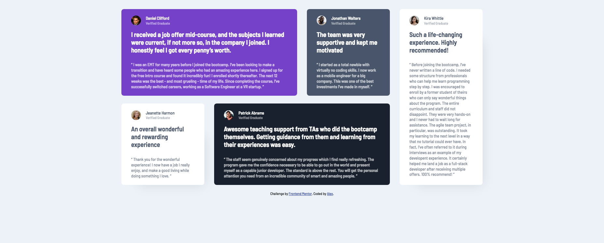

# Frontend Mentor - Testimonials grid section solution

This is a solution to the [Testimonials grid section challenge on Frontend Mentor](https://www.frontendmentor.io/challenges/testimonials-grid-section-Nnw6J7Un7). Frontend Mentor challenges help you improve your coding skills by building realistic projects. 

## Table of contents

- [Overview](#overview)
  - [The challenge](#the-challenge)
  - [Screenshot](#screenshot)
  - [Links](#links)
- [My process](#my-process)
  - [Built with](#built-with)
  - [What I learned](#what-i-learned)
- [Author](#author)

## Overview

### The challenge

Users should be able to:

- View the optimal layout for the site depending on their device's screen size

### Screenshot

### Links

- Solution URL: [https://www.frontendmentor.io/challenges/testimonials-grid-section-Nnw6J7Un7/hub/testimonials-page-using-css-grid-and-sass-29J0-MB8e](https://www.frontendmentor.io/challenges/testimonials-grid-section-Nnw6J7Un7/hub/testimonials-page-using-css-grid-and-sass-29J0-MB8e)
- Live Site URL: [https://axelf.github.io/Frontend-Mentor-Testimonials-grid-section/](https://axelf.github.io/Frontend-Mentor-Testimonials-grid-section/)

## My process

### Built with

- Semantic HTML5 markup
- SCSS
- CSS Grid
- Mobile-first workflow

### What I learned

The little details cause a lot of work. You have to look closely at the template.
Using SASS on github pages by adjusting my structure (non jekyll site) that it is working with jekyll.

## Author

- CodePen - [axelf](https://codepen.io/axelf)
- Frontend Mentor - [@axelf](https://www.frontendmentor.io/profile/axelf)